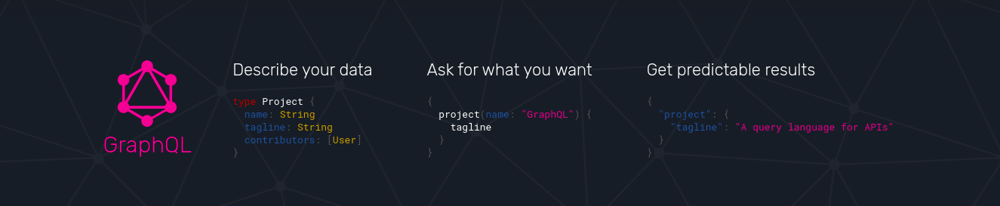

# Learning GraphQL

GraphQL is the hottest technology when it comes to server side APIs for good reason. It is incredibly fast to develop with, and it makes building a front-end painlessly easy.



GraphQL is a specific way to use tools that we already have. GraphQL is a specification built around HTTP for how you `GET` and `RECEIVE` resources from a server.

Normally, we will be using something like REST API when we interact with a server & RESTful endpoints, the HTTP methods like GET, POST, PUT ... for HTTP request using REST.

But, GraphQL gets rid of the whole idea of REST and all those endpoints. GraphQL gives us one single endpoint and based on the query that is sent to the endpoint, the server sends back the results.

Let's look at an example of how a GraphQL query works versus a REST query works.

Imagine that you have a application that has books and authors as the resources and each of these resources have 15 fields in each one. Books could have name, description, page count ... & same thing with author.

Now, in a frontend application, where we want to access just the author name and name of the books for that particular author. So, we want all the list of authors and their name for that particular author on the application as quickly as possible.

**REST API**

We have two endpoints:
| Endpoint | Title | Description |
| :-------- | :------- | :------------------------- |
| `/author` | author endpoint | ...to get all the authors|
| `/author/:id/books` | book endpoint | ...to get all the books for particular author |

First thing that we need to do is to access that authors endpoint to get back a list of authors and with that list of authors we are going to be getting back the ID of the authors and name which we want for the application. But also we get bunch of extra information such as address, email, contact ... which is not necessary for that page.

```json
[
  {
    "id": 1,
    "name": "Aakrit Subedi",
    "age": 24,
    "address": "Kathmandu",
    "country": "Nepal",
    "email": "aakritsubedi9@gmail.com",
    ...
  },
  {
    "id": 2,
    "name": "...",
    "age": 
    ...
  },
  ... 
]
```
Once, we have that list of authors, we use the ID of each author and call the server again to get the books for that particular author. So, if we have 100 authors, we have to call the book endpoint 100more times to get the books for those author and each time we invoke, it will send all the information back for the books not just the fields we required at the moment. 

By using REST API in order to access the data, we have to call the API many more times than we really want to and also get bunch of extra information back from our server which we don't actually need.

**GraphQL**  

With GraphQL, we compose a query of exactly the data that we want. So, simply we compose a query to get a list of all the author's name and get all the book's name for the particular author. 

| Endpoint | Method | Body |Description |
| :-------- | :------- |  :------- |:------------------------- |
| `/graphql` | POST | query |...to get data, based on the query|

```
query {
  authors {
    name
    books {
      name
    }
  }
}
```
The server will parse that query and send you back exactly that information that we want with just one query to the server.

```js
[
  {
    "name": "Aakrit Subedi",
    "books": [
      { "name": "Learning React" },
      { "name": "Learning Vue" },
      { "name": "Learning NodeJs" },
    ]
  },
  {
    "name": "Jk Rolling",
    "books": [
      { "name": "Harry Potter" }
    ]
  },
  ...
]
```
We get the information that we want with the single query. We get only the information that we asked for it. This is incredibly powerful and is the real reason that GraphQL is so important.

The ability to be able to not only query specific information but also query nested information without having to call the server more than one time.  
